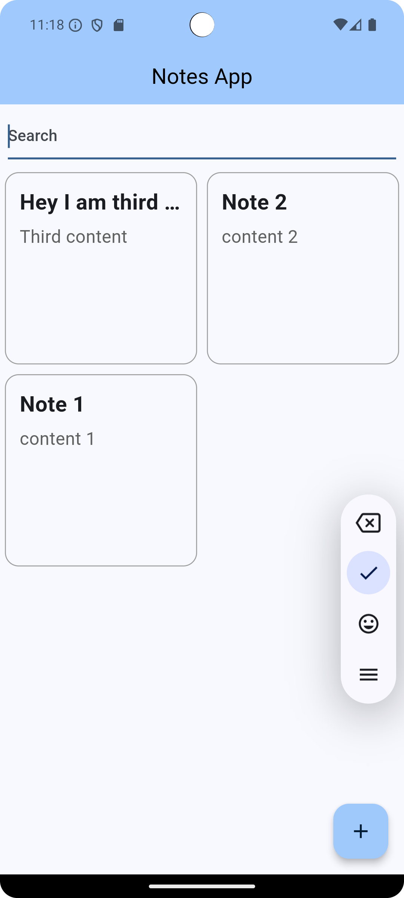
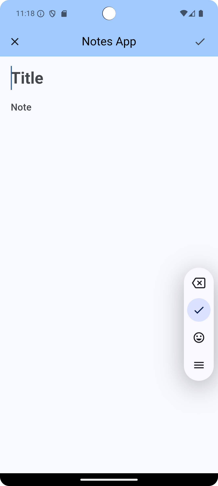
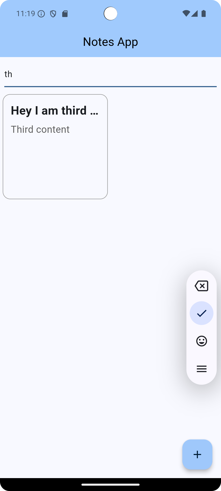

# Flutter Notes App

A simple Notes application built with Flutter, allowing users to create and manage notes seamlessly. The app communicates with a Node.js backend and stores data in MongoDB.

## Features

- Create notes with a title and content.
- Search notes stored on the server.
- Long press to delete notes.
- Automatically update the date of the notes.
- No login required.

## Packages Used

- [provider](https://pub.dev/packages/provider) (^6.1.2): State management for Flutter.
- [uuid](https://pub.dev/packages/uuid) (^4.5.1): Generate unique identifiers for notes.
- [http](https://pub.dev/packages/http) (^1.2.2): Make HTTP requests to the backend.

## Project Structure

```bash
lib/ 
├── models/ 
│   └── note_model.dart          # Data models for the application 
├── providers/
│   └── notes_provider.dart      # State management for notes 
├── pages/
│   ├── add_new_note_page.dart   # UI page for adding a new note 
│   └── home_page.dart           # Main UI page of the application 
├── services/
│   └── api_service.dart         # Service for making HTTP requests 
└── main.dart                    # Entry point of the application 
```

## Getting Started

### Prerequisites

- Flutter SDK
- Dart

### Installation

1. Clone the repository:
   ```bash
   git clone https://github.com/username/flutter_notes_app.git
   ```
   
2. Navigate to the project directory:
   ```bash
   cd flutter_notes_app
   ```

3. Install the dependencies:
   ```bash
   flutter pub get
   ```

4. Run the app:
   ```bash
   flutter run
   ```

## Screenshots

Here are some screenshots of the app:

### Screen Recording


### Home Screen


### Add New Note


### Search


## Usage

- Launch the app to create, view, and manage your notes.
- Use the search feature to find specific notes.
- Hold on a note to see the option to delete it.

## Backend Setup

Ensure that your Node.js server is running and connected to a MongoDB database for the app to function correctly. Provide instructions here if necessary for setting up the backend.

## Contributing

If you would like to contribute to this project, please follow these steps:

1. Fork the repository.
2. Create a new branch (`git checkout -b feature-branch`).
3. Make your changes and commit them (`git commit -m 'Add new feature'`).
4. Push to the branch (`git push origin feature-branch`).
5. Open a pull request.

## License

Specify the license under which your project is distributed. For example:

MIT License

## Acknowledgments

- Node.js for the backend.
- MongoDB for database storage.
